# Depatorium

## 프로젝트 개요
코로나 시기 많은 사람들은 재택근무를 많이 하게 되었습니다. 학교에서도 비대면 수업을 진행하게 되면서

원격으로 회의, 수업 등 서로 다른 장소에서 작업을 하면서 소통하기 위해 트렐로, 디스코드, 줌 등 다양한 협업 프로그램을 사용하였습니다.

하지만 이러한 협업 프로그램은 수평적관계에서 업무 비중의 편차가 발생한다는 문제가 있었습니다.

저희 팀은 이러한 문제를 해결하기 위해 업무에 적합한 협업사이트를 기획하게 되었습니다.

다른 협업 프로그램과 차별을 두기 위해 업무 팝업을 통해 업무를 배정 및 승인, 반려가 가능하도록 구현하였으며,

멤버의 직급별로 권한을 나누어 수평적 관계에서 오는 업무의 편차을 해결하였습니다.

## 기술 스택
* React
* Spring boot
    - Spring Security
    - OAuth2
    - WebSocket
* Html
* Javascript
* Css
* Mysql

## 구조
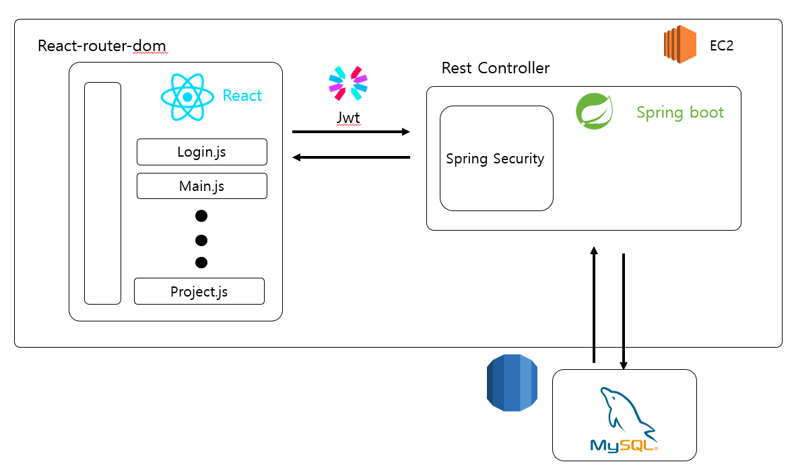

## 담당 영역
* 프로젝트의 UI/UX 디자인 설계 및 구현
* 프론트엔드 일괄 담당
* WebSocket을 통한 실시간 채팅 구현 및 파일 업로드 구현
* 프론트엔드와 백엔드 연동
* AWS를 통한 프로젝트 배포

## 구현 내용
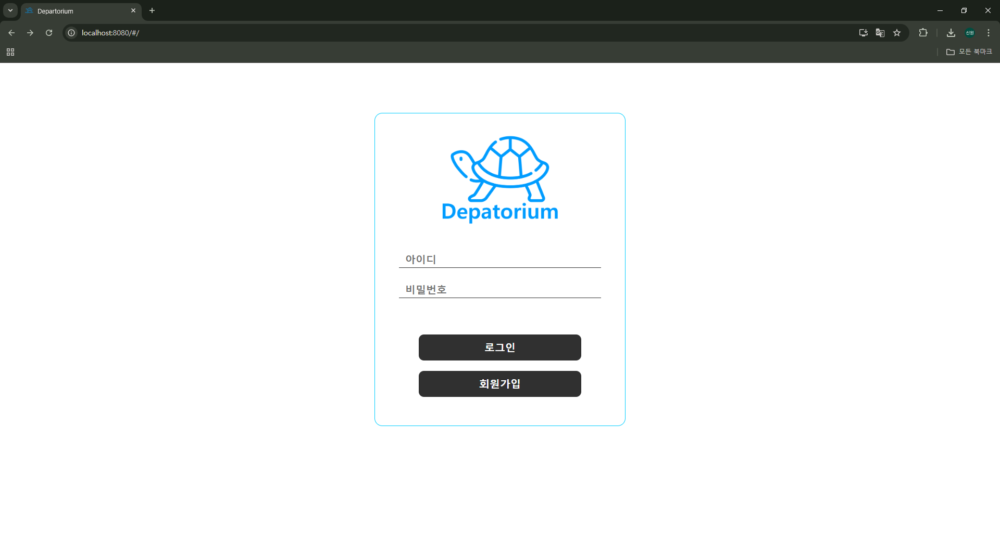
일반 회원가입을 통한 로그인과 구글 소셜로그인을 지원합니다. 

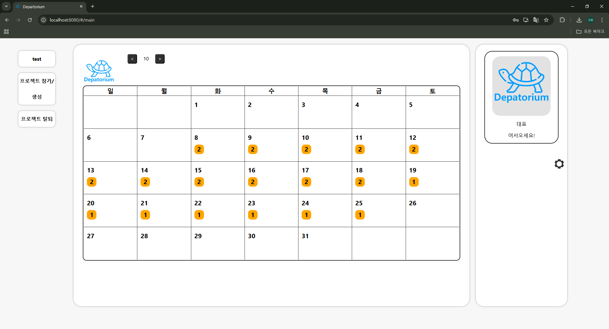
메인 페이지로 여기서 개인일정을 기록할 수 있으며, 프로젝트 참가 및 생성이 가능합니다. 또한 본인 정보수정도 가능합니다. 

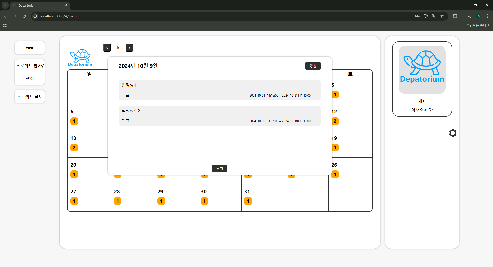
일자를 누르면 사진과 같이 일정 목록을 확인할 수 있습니다. 

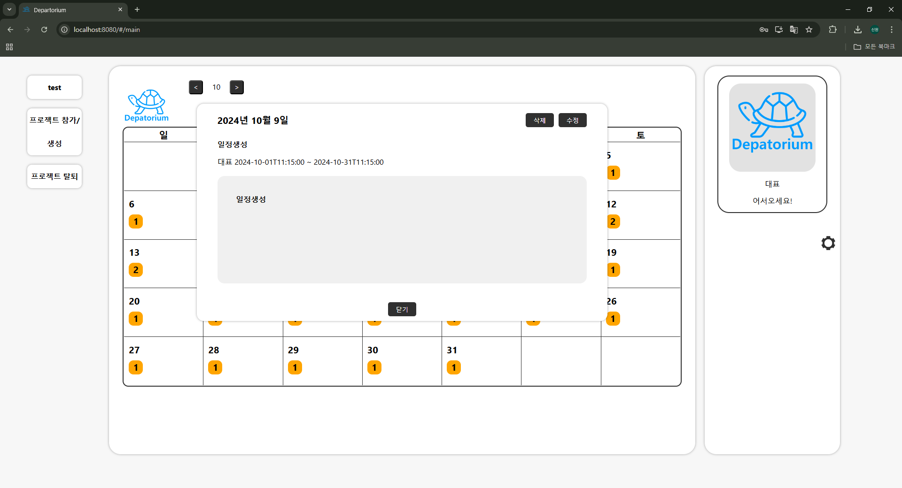
일정을 누르면 사진과 같이 상세 내역을 확인할 수 있으며, 수정 및 삭제 또한 가능합니다. 

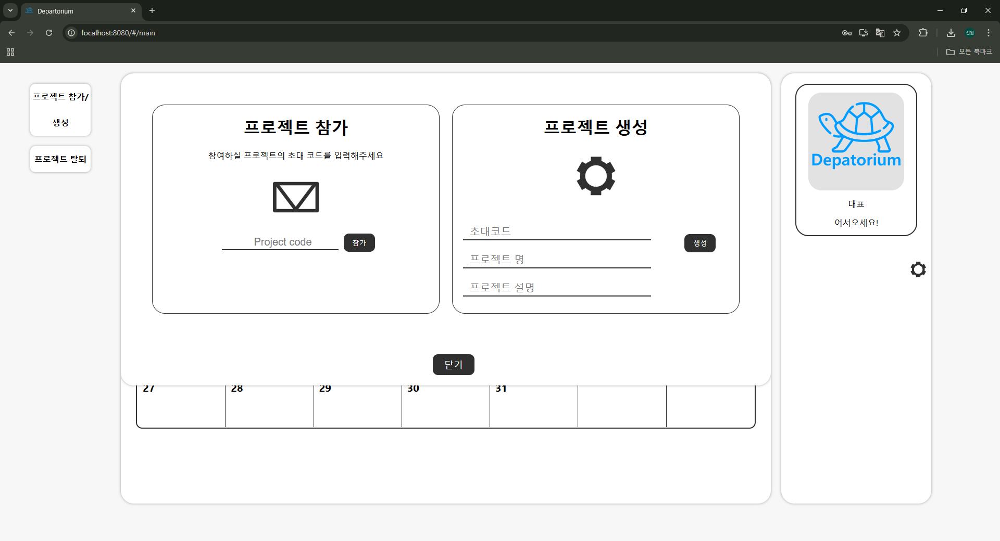
프로젝트 참가 및 생성 창으로 생성할 경우 초대코드, 프로젝트명, 소개말을 기입하여 생성합니다. 
초대코드는 프로젝트의 다른 사용자를 초대할 경우 사용되는 코드이며, 참가하는 사용자는 받은 초대코드를 통해 
참가할 수 있습니다.  

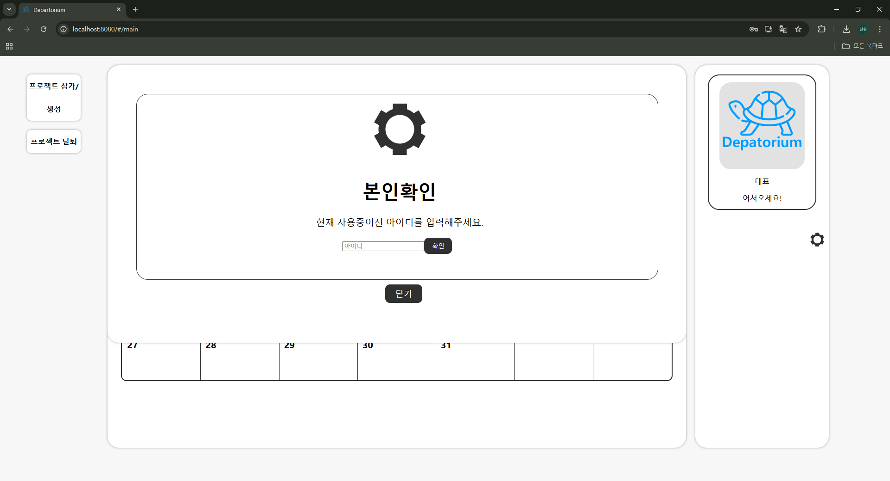
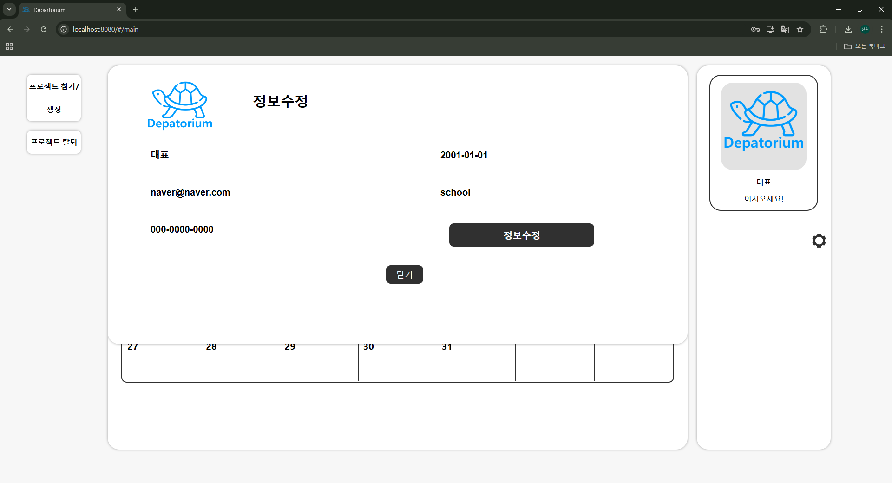
정보수정은 자신의 아이디를 입력하여 인증을 한 뒤 수정할 수 있게 구현하였습니다. 

프로젝트 페이지에 들어오면 프로젝트 생성할 때 작성한 소개말이 나옵니다. 
직무회의실이 배정되지 않았거나, 비활성화된 멤버일 경우 직무회의실에 참가하지 못하고 소개말만 나오게 하여 
초대코드 유출로 프로젝트에 참가해도 정보가 나가지 않게 구현하였습니다. 

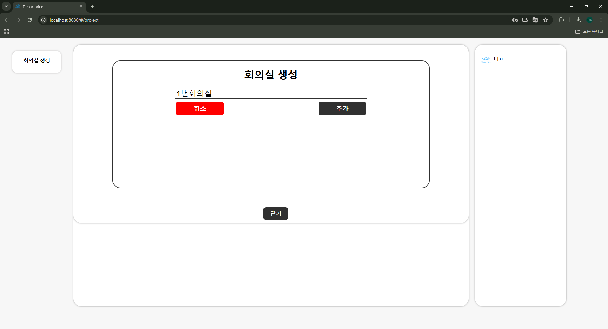
대표 계정 유저는 직무회의실을 생성할 수 있습니다. 

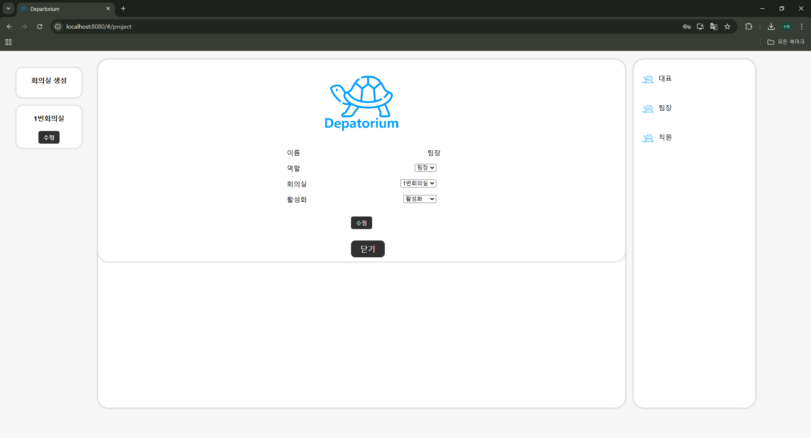
대표 계정 유저는 직원을 활성화, 비활성화 할 수 있으며, 직무회의실 배정을 할 수 있습니다. 
프로젝트 내의 모든 팀원은 배정받지 않은 회의실에는 참여할 수 없습니다. 

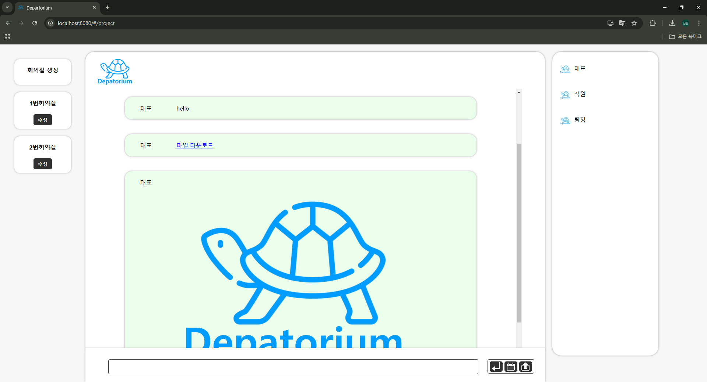
직무회의실 입니다. 여기서 사용자간의 실시간 대화가 가능하며, 파일 및 이미지 업로드 또한 지원합니다. 

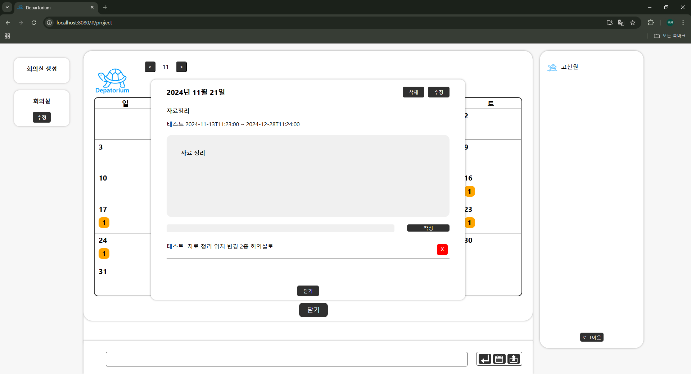
직무회의실 또한 일정기능이 있습니다. 개인일정과 다른 점은 하단의 댓글 기능을 통해 다른 팀원과의 소통이 가능하다는 점입니다. 

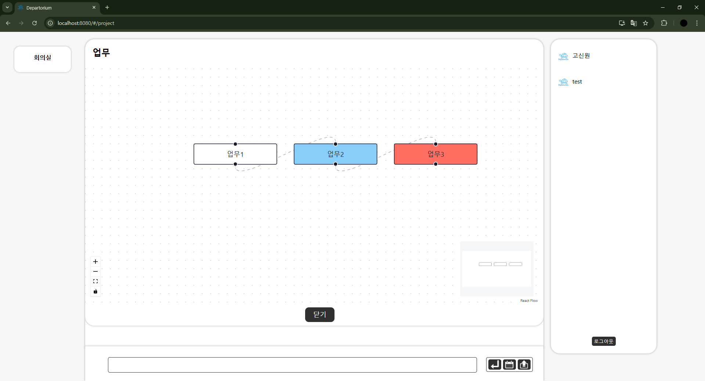
업무 팝업으로 직급에 따라 다르게 구성되며, 해당 사진은 직원에 업무페이지로 배정 받은 업무 목록이 나옵니다. 
이때 연계되는 업무는 연결선을 통해 표현되며, 클릭 시 상세 내역을 확인할 수 있습니다. 

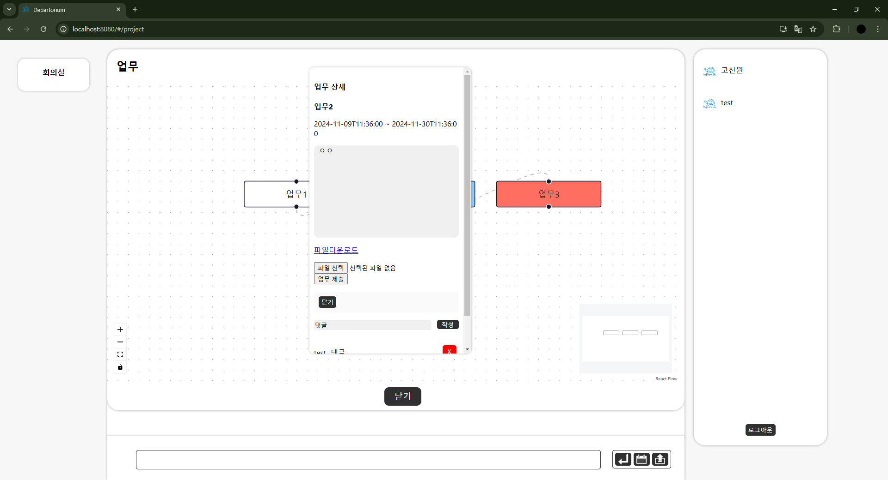
업무 상세 내역에서는 업무의 내용을 확인할 수 있으며, 댓글을 통해 소통이 가능합니다. 
또한 업무 관련 파일을 다운 받을 수 있으며, 업무를 제출할 수 있게 구현하였습니다. 

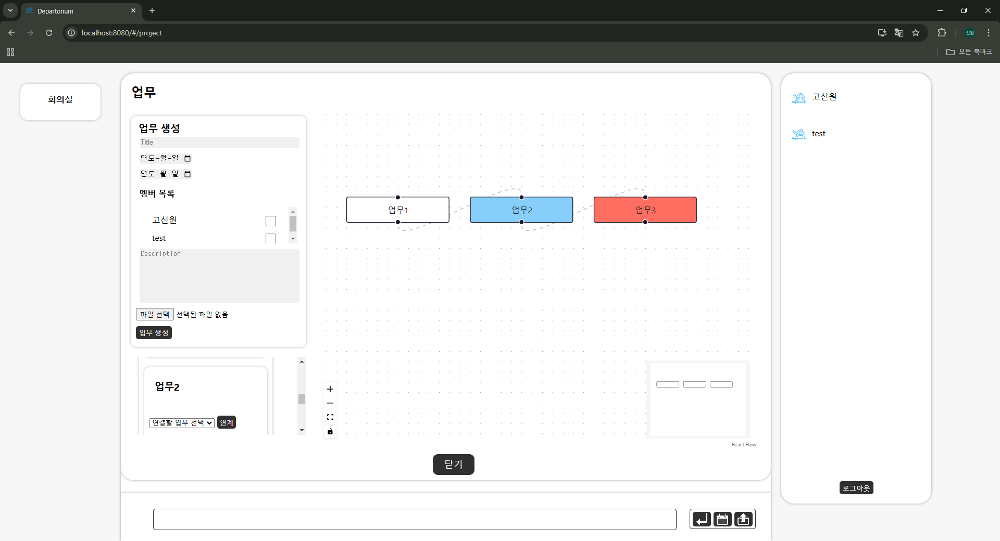
팀장 직급에 팀원이 보는 업무 페이지로 직원과는 다르게 업무 생성 폼과 연계 기능이 있는 것을 확인할 수 있습니다. 
폼에서 업무 내용 작성, 파일 업로드, 배정 등을 하여 생성합니다. 하단에서는 드롭다운 리스트를 통해 다른 업무와 연계를 설정할 수 있게 구현하였습니다. 

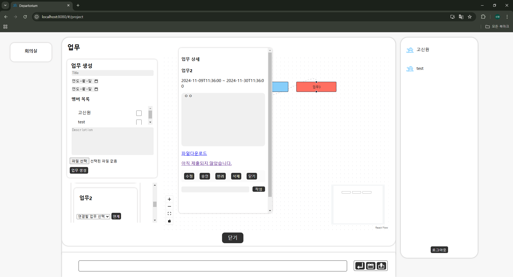
팀원 페이지와는 다르게 업무 제출란 대신 업무 다운로드 링크가 나옵니다. 배정 받은 직원이 업로드를 하지 않은 경우 제출되지 않았다는 문구가 나오며 
제출하면 다운로드 링크로 바뀌게 됩니다. 
그리고 업무의 승인, 반려, 수정, 삭제 버튼 또한 활성화 됩니다. 

